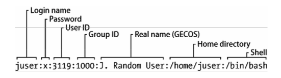
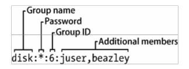

# 系统配置

-   [/etc目录结构](#/etc目录结构)
-   [系统日志](#系统日志)
-   [用户管理文件](#用户管理文件)
    -   [/etc/passwd文件](#/etc/passwd文件)
    -   [特殊用户](#特殊用户)
    -   [/etc/shadow文件](/etc/shadow文件)
    -   [用户和密码管理](#用户和密码管理)
    -   [用户组](#用户组)
-   [getty和login](#getty和login)
-   [设置时间](#设置时间)
-   [参考](#参考)

------

## /etc目录结构

Linux系统的大部分系统配置文件都存放在/etc目录中。按照惯例，每个程序在这里都有一个 或多个配置文件。因为Unix系统的程序数目很多，所以/etc目录也会越来越庞大。这样带来了两个问题:不仅很难找到要找的配置文件，而且维护起来也不方便。比如，要更改系统的日志配置，你需要编辑/etc/syslog.conf文件。但是你的更改可能会被随后的系统升级覆盖掉。

目前比较常见的方式是将系统配置文件放到/etc下的子目录，像我们介绍过的启动目录一样 (Upstart的是/etc/init，systemd的是/etc/systemd)。虽然/etc目录下仍然会有一些零散的配置文件，如果你运行ls -F /etc查看的话，你会发现大部分配置文件都放到了子目录中。

为了解决配置文件被覆盖的问题，你可以将定制的配置放到子目录里的其他文件中，如/etc/grub.d。

## 系统日志

系统日志是系统中最重要的部分之一。如果系统出现你不清楚的错误，查看系统日志文件是第一选择。

大多数Linux系统使用的是syslogd的一个新版本，叫作rsyslogd。它的功能不仅仅限于记录 日志信息。比如，你还可以让它加载一个将日志信息写到数据库的模块。不过最简单的方式还是 从/var/log目录开始。你看看其中的那些日志文件后，就能够了解它们来自哪里。

rsyslog的基础配置文件是/etc/rsyslog.conf，但你还会在其他地方(如/etc/rsyslog.d)发现另 外一些配置文件。其内容包含传统的规则和rsyslog扩展。其中一条规则是任何以字符$开头的都 是扩展。

## 用户管理文件

Unix系统支持多用户。用户对于内核而言只是一些数字(用户ID)，因为用户名比数字容易 记忆，所以用户一般都是用用户名(或登录名)而非用户ID来管理系统。用户名只存在于用户空 间，使用到用户名的应用程序在和内核通信时，通常需要将用户名映射为用户ID。

### /etc/passwd文件

文本文件/etc/passwd中包含一一对应的用户名和用户ID。

```
root:x:0:0:Superuser:/root:/bin/sh 
daemon:*:1:1:daemon:/usr/sbin:/bin/sh 
bin:*:2:2:bin:/bin:/bin/sh 
sys:*:3:3:sys:/dev:/bin/sh 
nobody:*:65534:65534:nobody:/home:/bin/false
juser:x:3119:1000:J. Random User:/home/juser:/bin/bash 
beazley:x:143:1000:David Beazley:/home/beazley:/bin/bash
```

每一行代表一个用户，一共有7列，用冒号:分隔。这7列所代表的内容如下所示

-   登录名
-   经过加密的用户密码。大部分Linux系统都不在passwd文件中存放实际的用户密码，而是将密码存放在shadow文件中(见7.3.3节)。shadow文件的格式和passwd类似，不过普通用 户没有访问权限。passwd和shadow文件中的第2列是经过加密的密码，是一些像 d1CVEWiB/oppc这样的字符，读起来很费劲。(Unix从不明文存储密码。)，第2列中的x代表加密过的密码存放在shadow文件中。*代表用户不能登录，如果为空(像::这样)，则表示登录不需要密码。(绝对不要将普通用户的该列设置为空。)
-   用户ID。它是用户在内核中的标识。同一个用户ID可以出现在两行中，不过这样做比较容易产生混淆，程序在处理时也需要将它们合并起来。用户ID必须唯一。
-   用户组ID。它是/etc/group文件中的某个ID号。用户组定义了文件权限及其他。该列也称为用户的基本组。
-   用户的真实名称(通常称为GECOS列)。有时候其中会有逗号，用来分隔房间和电话号码。
-   用户的root目录。
-   用户使用的命令行，即用户运行终端的程序。



### 特殊用户

在/etc/passwd中有一些特殊用户。其中，超级用户的UID和GID固定为0，如例7-2所示。有一 些用户如守护进程用户没有登录权限。nobody用户的权限最小。一些进程在nobody用户名下运行， 因为它没有任何写入权限。

无法登录的用户我们称为伪用户。虽然无法登录系统，但是系统可以使用它们来运行一些进 程。创建像nobody用户这样的伪用户，目的是为了安全考虑。

### /etc/shadow文件

Linux中的影子密码文件(/etc/shadow)包含用户验证信息以及经过加密的密码和密码过期日 期，这些都和/etc/passwd文件中的用户相对应。

### 用户和密码管理

普通用户使用passwd命令来更改密码。默认状态下，passwd可以更改用户密码，但你还可以 使用-f选项来更改用户名，用-s选项来更改shell(/etc/shells中有shell列表)。(你还可以使用chfn 和chsh来更改用户名和shell。)passwd命令是一个suid-root程序，只有超级用户能够编辑/etc/passwd 文件。

### 用户组

用户组可以将文件访问权设定给某些用户，而使其他用户无权访问。你可以为某组用户设置 读写位，从而排除其他的用户。在多名用户共享一台主机的时候，用户组很有用。然而现在我们 很少在主机上共享文件了。

/etc/group文件中包含了用户组ID(类似/etc/passwd文件中的ID)，

```
root:*:0:juser 
daemon:*:1:
bin:*:2:
sys:*:3:
adm:*:4: 
disk:*:6:juser,beazley 
nogroup:*:65534: 
user:*:1000:
```

和/etc/passwd文件一样，/etc/group中的每一行有多列，由冒号分隔。每一列所代表的内容如 下所示。

-   用户组名:运行如ls -l这样的命令时可以看到。
-   用户组密码:很少也不该被使用(使用sudo替代)。可以设置为*或者其他默认值。
-   用户组ID:必须是一个唯一的数字。用户组ID出现在/etc/passwd文件的用户组列中。
-   属于该组的用户列表:该列是可选项，passwd文件中的用户组ID列也定义了用户属于哪个用户组。



你可以使用group命令来查看你所属的用户组。

## getty和login

getty连接到终端并且在其上显示登录提示符。大多数Linux系统中的getty程序很简单，仅仅 是在虚拟终端上显示登录提示符。它可以用在管道命令中，如下所示:

```bash
$ ps ao args | grep getty 
/sbin/getty 38400 tty1
```

输入用户名后，getty调用login程序提示你输入密码。如果输入的密码正确，login会调用你 的shell(使用exec())。否则你会得到“登录错误”提示信息。

## 设置时间

Unix系统的运行依赖精确的计时，而内核则负责维护系统时钟。你可以使用`date`命令来查看，还可以用它设置时间，不过并不推荐这样做，因为设置的时间有可能不精准，而你的系统时间应该尽可能精准。你可以使用以 下命令将内核的UTC时钟设置为RTC:

```
hwclock --hctosys --utc
```

## 参考

[精通linux(第二版)](https://www.ituring.com.cn/book/1548)
